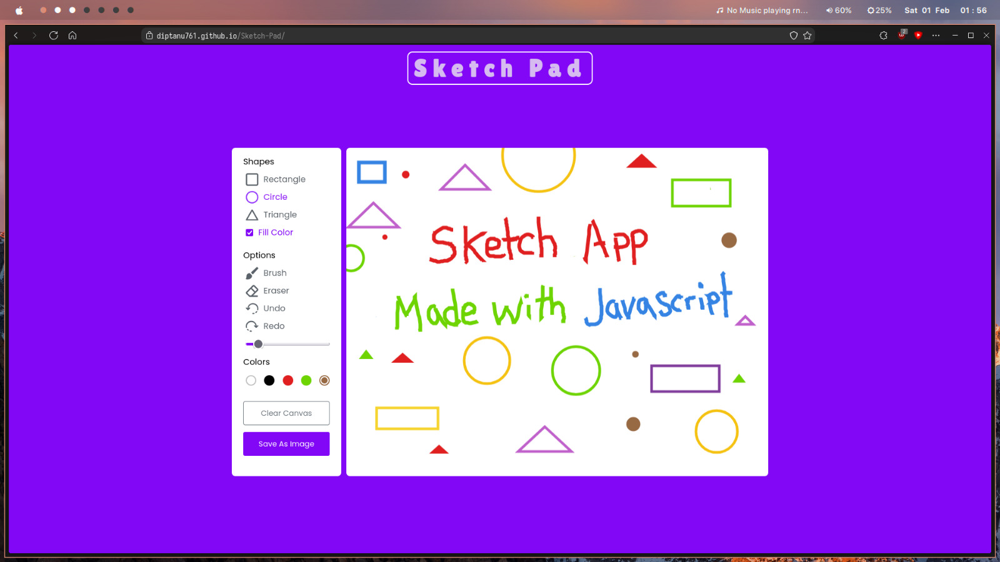

# 🎨 **Sketch Pad** 🖌️

Welcome to **Sketch Pad**, a creative canvas where you can unleash your imagination and bring your beautiful thoughts to life! 🎉 Whether you're a beginner or an experienced artist, Sketch Pad is designed to help you sketch, doodle, and create without limits. ✏️✨

## 🌟 Features:

- **🎨 Drawing Tools**: Choose from a variety of tools like brushes, shapes, erasers, and more to customize your masterpiece.
- **🖍️ Color Palette**: Pick your favorite colors from a wide selection, or use the color picker to find the perfect shade. 🌈
- **🔄 Undo & Redo**: Made a mistake? No problem! Use the undo and redo buttons to fix it with ease. ↩️↪️
- **🖼️ Save & Share**: Save your artwork as an image and share it with friends, or keep it as a memory. 💾📸
- **💥 Brush Size**: Control the thickness of your brush with the slider and adjust it for your design needs. 🎯
- **🖱️ Click, Drag, and Draw**: Simply click, drag, and draw your way through your creative process! 🖋️

## 🚀 How to Use:

1. Open the website and choose your drawing tool. 🎨
2. Select your color from the palette or the color picker. 🌈
3. Use the brush or shapes to create your design. ✏️
4. Want to clear your canvas? Click the **Clear Canvas** button. 🧹
5. Once you're done, **Save as Image** to preserve your masterpiece! 📥

## 🛠️ Technologies Used:

- **HTML5** 🏗️
- **CSS3** 🎨
- **JavaScript** ⚙️
- **GitHub Pages** 🌍

## 🌐 Live Demo:

Check out the live demo of Sketch Pad here:  
[Sketch Pad Live](https://Diptanu761.github.io/Sketch-Pad/) 🎉

## 📸 Screenshots And Videos:

### Click on the picture below to view the video

## 🤝 Contributing:

We welcome contributions from all creative minds! If you have an idea to improve Sketch Pad or fix any bugs, feel free to fork the repository and create a pull request. 🔄

## 📌 Future Features:

- More **shapes** and **tools** to explore 🎨
- Add **layers** for better design control 🖼️
- Save projects and continue later 🔄
- **Share** your art on social media 📱

## 💬 Feedback:

We would love to hear from you! Please provide any feedback or suggestions in the **Issues** section. 🚀

## 📝 License:

This project is licensed under the **MIT License** - see the [LICENSE.md](LICENSE.md) file for details.

## 🙌 Credits:

- **Icon assets**: [Flaticon](https://www.flaticon.com) for providing free icons used in the website 🖼️✨
- **Fonts**: [Google Fonts](https://fonts.google.com) for beautiful, free fonts that enhance the design 🌟
- **Color Palette**: [Coolors](https://coolors.co) for the amazing color palette used to bring creativity to life 🎨
- **CodingNepal**: [Youtuber](https://www.youtube.com/@CodingNepal) for the amazing idea ✨

## 📲 **Follow Me on Instagram**  

Stay connected for more updates, behind-the-scenes sneak peeks, and gaming fun! Follow me on Instagram:   
 
---

Unleash your creativity with **Sketch Pad** — your canvas to the world of imagination! ✨🎉
